# **_تحديد الاحتياجات لمتدربي الكلية التقنية بالخرج_**

# **_- نظرة عامة على طلاب الكلية التقنية المشاركين بالاستبيان_**

### **_الجنسية:_**

سعودي 1178 
غير سعودي 11

### **_العمر_**
؛

    متوسط اعمار الطلاب 20
    اصغر طالب عمرا 17
    اكبر طالب عمرا 47
    متوسط الفارق العمري بين الطلاب 3 سنوات

### **_التخصص التدريبي:_**
  

***عدد الطلاب في كل تخصص:*** 
 
تقنية القوى الكهربائية 264 
تقنيات الاعمال المكتبية 197 
تقنيات محاسبية 144 
تقنية الإلكترونيات أنظمة التحكم 139 
تقنية الدعم الفني للحاسب 139 
تقنية شبكات الحاسب 132 
تقنية المحركات والمركبات 116 
تقنية الآلات الكهربائية 58 

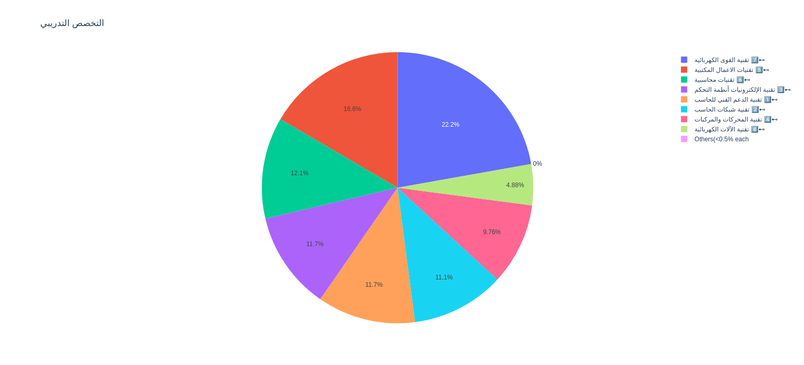 

    اكثر الطلاب مشاركة في الاستبيان طلاب القوى الكهربائية بنسبة 22% 
    واقل الطلاب مشاركة طلاب تقنية الالات الكهربائية

   

***هل دخلت التخصص المناسب لك ؟*** 
نعم     734 
ربما    337 
لا      118 
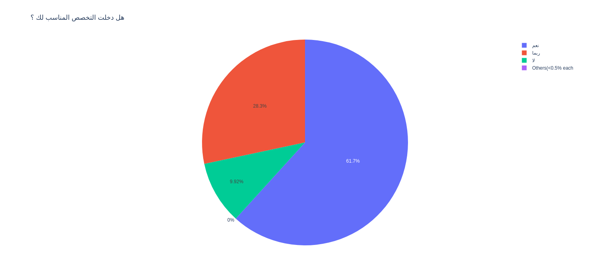

***هل دخلت التخصص الذي ترغب فيه ؟*** 
نعم     697 P
ربما    296 
لا      196 
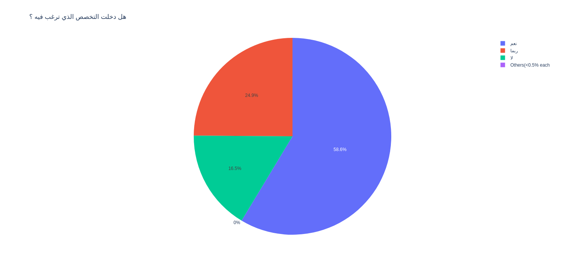

***هل دخلت التخصص المناسب لك ؟ (بناء على التخصص)*** 

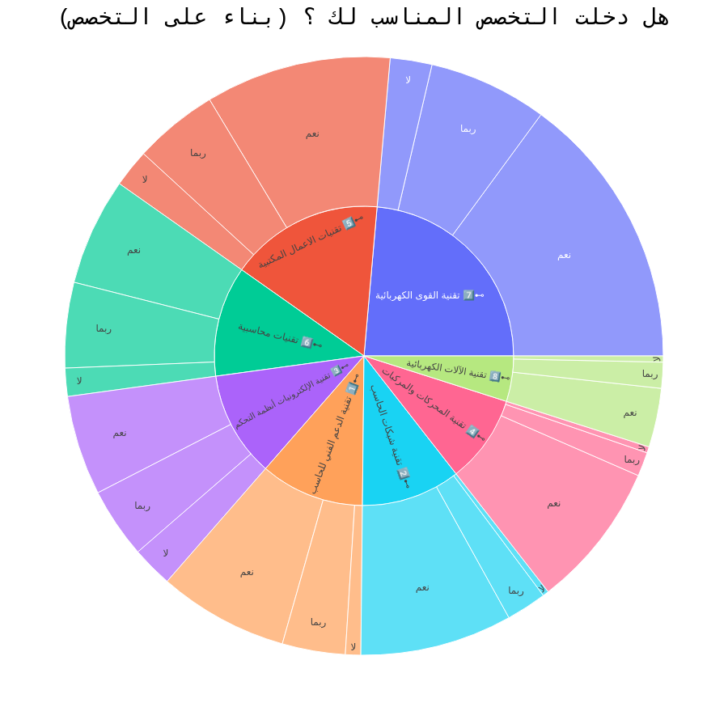
 
 
 

***هل دخلت التخصص الذي ترغب فيه ؟	*** 

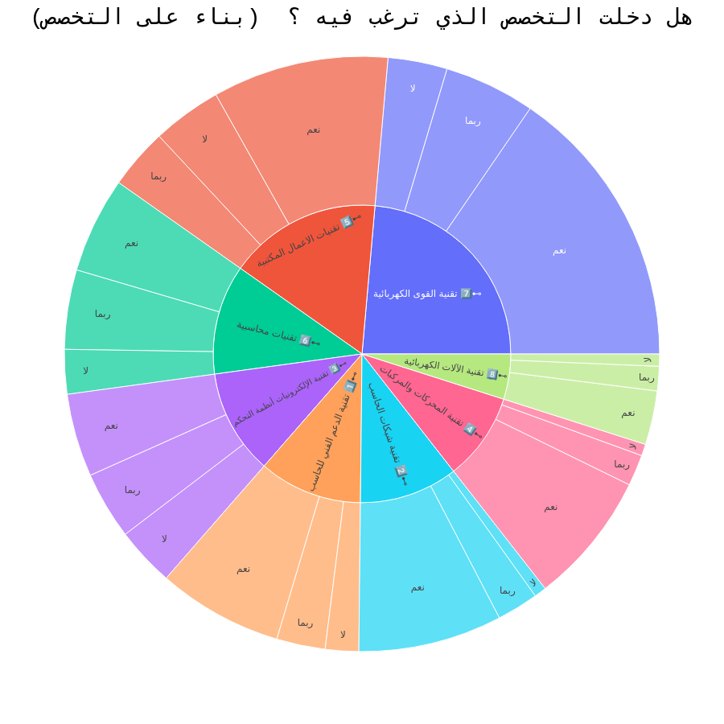
  
  

    734 من الطلاب يرون ان التخصص مناسب لهم يرون التخصص مناسب لهم بنسبة 61%
    58% من الطلاب راغبين بتخصصهم و البيقية ما بين متردد وغير راغب
    اكثر التخصصات التي يرى طلابها انها غير مناسبة لهم 
    [تقنية الالكترونيات انطمة التحكم - تقنيات الاعمال المكتبية - تقنيات القوى الكهربائية]
    اكثر التخصصات الغير مرغوبة من قبل طلابها [تقنيات محاسبية - تقنية الالمكترونيات انظمة التحكم]

#### ***نسبة التفاعل في الاستبيان والمستوى التدريبي***
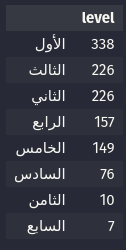

    اغلب الطلاب المشاركين في الاستبيان هم طلاب المستويات الاولى 
    يستنتج زيادة الحماس للتغيير بقلة العر
  
  
### **_المعدل_**
  

 

***متوسط معدل الطلاب 3.23*** 
***متوسط الفارق بين معدلات الطلاب 0.8*** 
***افل معدل 1*** 
***اعلى معدل 5*** 
 
 
 

#### ***المعدل والتخصص***
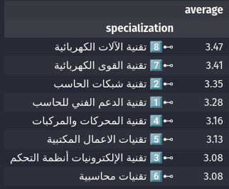

    - اعلى الطلاب معدلا طلاب تقنة الالات الكهربائية بفارق عن المتوسط 0.23 
    - واقلهم طلاب تقنية المحاسبية بفارق عن المتوسط -0.15

   

#### ***العلاقة بين العمل أثناء التدريب أو بعد التدريب والمعدل التراكمي***

- اثناء التدريب 

 
 
- بعد التدريب 

 
 
 

    في كلا الحالتين يوجد فارق لمن صوتوا بنعم
    للعمل اثناء او بعد التدريب له اثر في ارتفاع معدل الطالب 

   

#### ***قياس العلاقة بين المعدل والمستوى التدريبي***

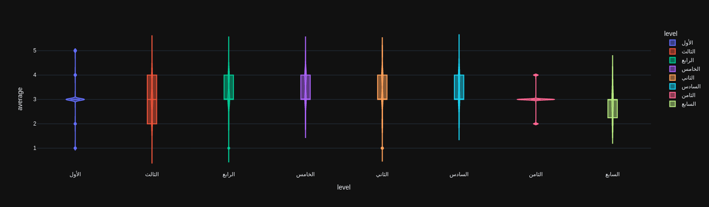
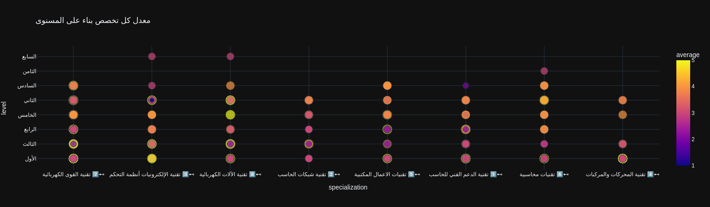

    - في قياس العلاقة بين المعدل والمستوى التدريبي 
    يتضح انخفاض معدل غالبية الطلاب المستوى الاول عن المتوسط
    - المستوى الثاني اكثر المستويات تباينا في المعدل بين الطلاب

   

#### ***قياس بين المعدل والاسئلة التالية:***

***هل دخلت التخصص المناسب لك ؟*** 
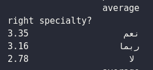

***هل دخلت التخصص الذي ترغب فيه ؟*** 
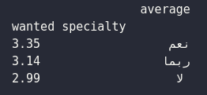

***هل تخصصك مناسب لميولك وقدراتك ؟*** 
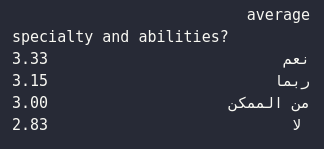

***هل كان دخولك بالكلية اضطراري ام اختياري:*** 

 
 

#### ***قياس رغبته في التخصص مع اضطرارية او اختيارية دخوله للكلية***

#### ***العلاقة بين المعدل التراكمي وبين الهدف الأساسي لدخول الكلية التقنية***

    - يوجد علاقة واضحة بين اختيار التخصص المناسب وارتفاع معدل الطالب بفارق يزيد عن 0.9
    - يوجد علاقة بين دخول التخصص المرغوب فيه وارتفاع المعدل بنسبة 0.5 تقريبا
    - يوجد علاقة بين ارتفاع المعدل ومناسبة التخصص لقدرات الطالب بنسبة 0.50
    - يوجد علاقة في ارتفاع المعدل لاختارية الدراسة على الاصطرارية بنسة 0.10

#### ***العلاقة بين إجراء مقياس للميول المهنية ودخول التخصص المناسب***

    - يوجد علاقة واضحة في اجراء مقياس للميول المهنية ودخول التخصص المناسب

   

## ***تلخيص لابرز نقاط القسم:***
    - متوسط اعمار الطلاب 20
    - متوسط الفارق العمري بين الطلاب 3 سنوات
    - زيادة الفارق يعني زيادة التباين بين اعمار الطلاب
    - اكثر الطلاب مشاركة في الاستبيان طلاب القوى الكهربائية بنسبة 22% واقل الطلاب مشاركة طلاب تقنية الالات الكهربائية
    - 734 من الطلاب يرون ان التخصص مناسب لهم يرون التخصص مناسب لهم بنسبة 61%
    - 58% من الطلاب راغبين بتخصصهم و البيقية ما بين متردد وغير راغب
    - اغلب الطلاب المشاركين في الاستبيان هم طلاب المستويات الاولى يستنتج زيادة الحماس للتغيير بقلة العر
    - متوسط معدل الطلاب 3.23
    - متوسط الفارق بين معدلات الطلاب 0.8
    - اعلى الطلاب معدلا طلاب تقنة الالات الكهربائية بفارق عن المتوسط 0.23 
    - واقلهم طلاب تقنية المحاسبية بفارق عن المتوسط -0.15
    - للعمل اثناء او بعد التدريب له اثر في ارتفاع معدل الطالب 
    - في قياس العلاقة بين المعدل والمستوى التدريبي يتضح انخفاض معدل غالبية الطلاب المستوى الاول عن المتوسط
    - المستوى الثاني اكثر المستويات تباينا في المعدل بين الطلاب
    - يوجد علاقة واضحة بين اختيار التخصص المناسب وارتفاع معدل الطالب بفارق يزيد عن 0.9
    - يوجد علاقة بين دخول التخصص المرغوب فيه وارتفاع المعدل بنسبة 0.5 تقريبا
    - يوجد علاقة بين ارتفاع المعدل ومناسبة التخصص لقدرات الطالب بنسبة 0.50
    - يوجد علاقة في ارتفاع المعدل لاختارية الدراسة على الاصطرارية بنسة 0.10
    - يوجد علاقة واضحة في اجراء مقياس للميول المهنية ودخول التخصص المناسب
    - لا يوجد علاقة بين وضوح معايير تغيير التخصص ودخول التخصص المرغوب به

   
   
   
   

# **_المهارات الاساسية_**

#### ***نظرة عامة على المهارات الاساسية***

#### ***اكثر المهارات احتياجا***

#### ***اقل المهارات اجتياجا***

#### ***مهارات توسط الاتقان***

### ***العلاقة بين كل مهارة وجدارة والمعدل***

## ***تلخيص لابرز نقاط المهارات الاساسية***
    - عدد الطلاب اللذين قاموا باختيار واحد لجميع المهارات 154 طالب وتم ابعادهم لعدم منطقية اختياراتهم
    - اكثر المهارات احتياجا *الاقل اتقانا*:  معرفة سوق العمل - البحث عن وظيفة - ادارة المشاريع - الالقاء - بوربوينت
    -اقل المهارات احتياجا *الاكثر اتقانا*: الكتابة - المرونة - القراءة - مهارات التواصل - المهارات التقنية
    - في قياس العلاقة بين اتقان المهارة وارتفاع المعدل يوجد 5 من بين كل المهارات لهم اثر في ارتفاع معدل الطالب
    - [مهارة الحاسب والتقنية - مهارات التواصل - مهارة القراءة - مهارة المرونة - مهارة الوورد والاكسل]
    - قد لايكتفى بتقييم الطلاب لانفسهم في المهارات واجراء بعض الاختبارات للتأكد من صحة تقييم الطلاب لانفسهم بالمهارات

   
   
   
   

# ***استكشاف اراء الطلاب عن الكلية***

## ***تلخيص لابرز نقاط القسم:***
    - وضوح معالم التخصص عند 609 من الطلاب بنسبة 59% من الطلاب
    - وضوح نظام الكلية في تغيير التخصص عند 676 من الطلاب بنسبة 67% من الطلاب
    - وضوح معيير تغيير التخصص عند 692 من الطلاب بنسبة 65% من الطلاب

   
   
   
   

# ***تلخيص لابرز احتياجات الطلاب***

### ***اكثر الكورسات طلبا***
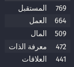

### ***ابرز الاحتياجات المعلنة***

